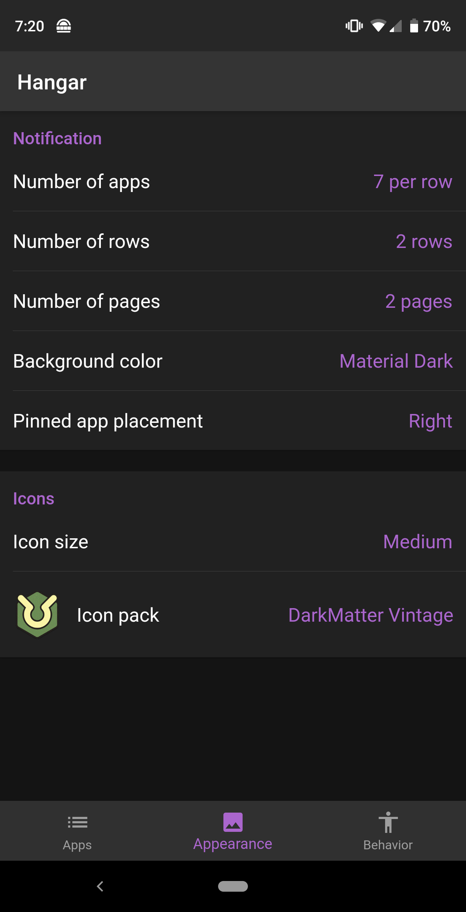

# Hangar
Hangar (3.0?) for Android -- rewritten in Kotlin and Flutter
Currently a WIP rebuild of the original [Hangar](https://github.com/corcoran/hangar)
## TODO
- Icon pack support
- Stats homescreen widget
- App shortcuts homescreen widget
## Screenshots

## Building
There are a few glitches and gotchas that seem to happen (currently) when your Android app has a Flutter module.
1) Set the `sdk.dir` and `flutter.sdk` variables in `app/settings/.android/local.properties` to reflect where you have the Android SDKs and flutter SDK installed respectively.
2) Due to [this issue](https://github.com/flutter/flutter/issues/28805), Flutter modules do __not__ use AndroidX by default. However, the Flutter module in Hangar has been updated manually to use AndroidX. Anytime `flutter packages` (or possibly other flutter related commands) are run, Flutter overwrites `app/settings/.android/` files with pre-AndroidX copies.  Run the script `restore_androidx.sh` in `app/settings/` _before_ committing changes to reset back to the working AndroidX versions.
3) If you wish to use Flutter hot reload, run `flutter attach` in `app/settings` _before_ running a debug build.
4) Dart support seems to randomly switch off in Android Studio.  Enable to fix.
5) Occasionally the `io.flutter.plugins.GeneratedPluginRegistrant` import in `MainActivity` will fail to be found by Android Studio. Gradle sync will look like it's succeeding but you'll see the pinned message that it has failed.  Restarting Android Studio seems to fix this.
6) Don't forget about note #2.  If you notice things are being weird it may be due to Flutter overwriting AndroidX files in `app/settings/.android/`.  Do a git diff and see if that's the case!